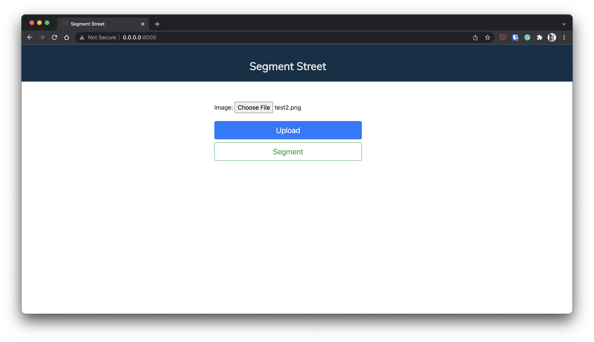
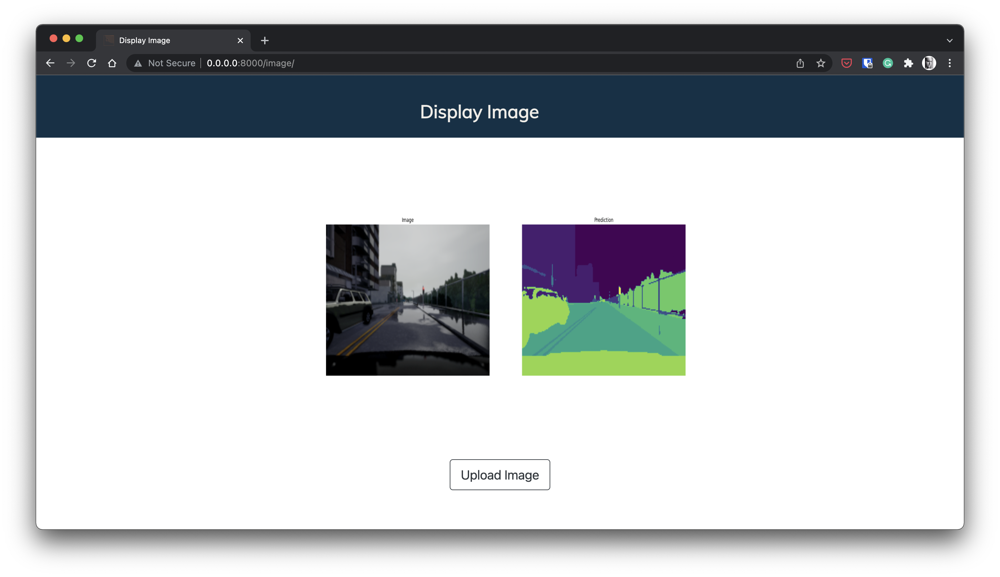

# Street_Segmentation

## Colab

run provided notebook in google colab:

 

## About

A segmenter on street view with 23 class, for self driving car. from this [link](https://www.kaggle.com/kumaresanmanickavelu/lyft-udacity-challenge) you can check dataset on kaggle.  
Images are in shape (160, 240) and 3 channels, Model is UNet in Pytorch framework.
 

## Usage 

first download unet model from google drive by execute [get_weights.sh](./models/get_weights.sh):

    chmod +x get_weights.sh
    ./get_weights.sh

then in your local computer to start `Django` server run following commands in your terminal:

1- **makemigrations**

    $ python3 manage.py makemigrations

2- **migrate**

    $ python3 manage.py migrate

3- **runserver**

    $ python manage.py runserver 0.0.0.0:8000

 

>***Note***: don't forget to install requirements.txt

    $ pip3 install -r requirements.txt

 

## Docker

    $ docker-compose up --build

 

## UI

